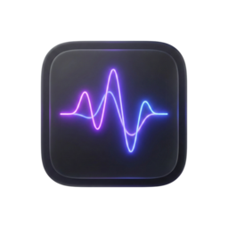

# Aether // Neural Audio Interface



A next-generation music player exploring the boundaries of neural audio interfaces and modern aesthetics. Built with Electron and React, Aether provides a seamless, high-performance bridge to SoundCloud's vast library.

## ✨ Features

- **💠 Glassmorphism UI:** A stunning, distraction-free interface with real-time blur, AMOLED-friendly themes, and fluid Framer Motion animations.
- **🧠 Neural Wave Recommendations:** Advanced discovery engine that generates infinite radio mixes based on your sonic preferences.
- **🛰️ Custom Discord IPC:** Hand-crafted Discord Rich Presence integration for stable, low-overhead activity sharing.
- **🔍 Smart Search:** Natural language processing for finding music based on mood, genre, and era.
- **📁 Local Collections:** Create and manage your own playlists with AI-powered track suggestions.
- **🎛️ Dynamic Audio Engine:** Built-in visualizers and 10-band equalizer support for the perfect listening experience.

## 🚀 Getting Started

### Prerequisites
- [Node.js](https://nodejs.org/) (v18 or higher)
- [npm](https://www.npmjs.com/) or [yarn](https://yarnpkg.com/)

### Installation

1. **Clone the repository:**
   ```bash
   git clone https://github.com/norius/aether.git
   cd aether
   ```

2. **Install dependencies:**
   ```bash
   npm install
   ```

3. **Run in development mode:**
   ```bash
   npm run electron
   ```

## 🛠️ Tech Stack

- **Frontend:** React 19, Vite, Tailwind CSS 4, Framer Motion
- **Desktop:** Electron 39
- **State & Data:** Context API, IDB-Keyval (IndexedDB)
- **API:** SoundCloud v2 Integration

## 📦 Deployment

To build a production-ready installer:

```bash
npm run build:electron
```

The output will be available in the `dist_electron` directory.

## 📄 License

This project is licensed under the MIT License - see the [LICENSE](LICENSE) file for details.

---
Created with 💜 by [norius](https://norius.ru)